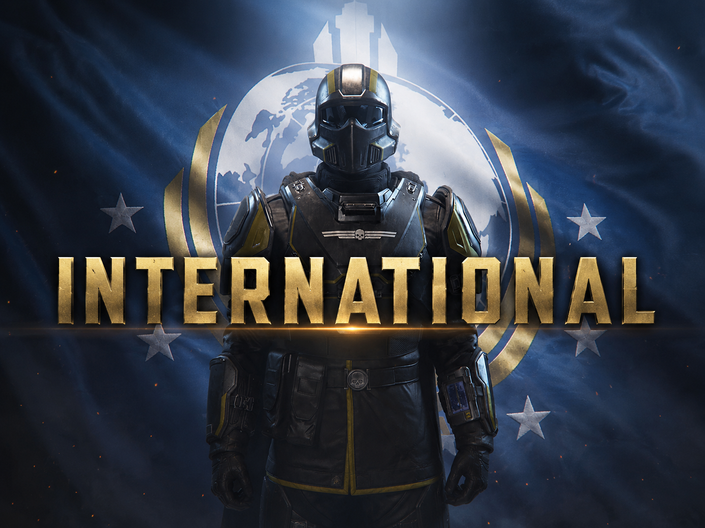

<h1 align="center">Helldivers International Randomizer</h1>

<em>Sorteie voz e idioma para cada espaço vocal dos Helldivers. Ferramenta complementar ao mod Helldivers International.</em>

 

| [English](README.md) | [Español · ES](README.es.md) | [Español LATAM · MS](README.ms.md) | [日本語 · JP](README.jp.md) | [Deutsch · DE](README.de.md) | [Français · FR](README.fr.md) | [Italiano · IT](README.it.md) | [Português · BP](README.bp.md) | [简体中文 · CN](README.cn.md) | [Русский · RU](README.ru.md) | [한국어 · KO](README.ko.md) |

---

## 🎮 O que faz

> **Mod necessário:** este aplicativo complementar não funciona sozinho. Primeiro, baixe e instale [Helldivers International no Nexus Mods](https://www.nexusmods.com/helldivers2/mods/14183). Use o arquivo principal para os nove idiomas do jogo e o arquivo **Fandubs** da mesma página para as vozes em russo ou coreano. Selecione a pasta do mod instalado; se não usar o Arsenal, extraia primeiro o arquivo baixado. O Randomizer não inclui o mod nem os áudios.

Sorteia tipo de voz e idioma para os quatro espaços vocais dos Helldivers e grava arquivos patch na pasta de dados de Helldivers 2. Aceita os nove idiomas do jogo e, quando incluídos no mod selecionado, os fandubs em russo e coreano.

Também pode randomizar os arquivos **Ship & Air** e **Mission** da mesma página: cada personagem (Eagle-1, Pelican-1, tripulação, soldados SEAF, civis) recebe um idioma aleatório. Essas duas pastas são opcionais.

## 🚀 Instalação e uso

1. Baixe **HelldiversInternational-Randomizer.exe** pelo botão acima.
2. Selecione a pasta do mod que contém **manifest.json**. Se quiser, selecione também as pastas de Ship & Air e Mission.
3. Selecione a pasta **data** de Helldivers 2 que contém **bundles.nxa**.
4. Escolha as opções e clique em **Randomizar tudo**, ou use os botões abaixo para randomizar um único mod. Os outros mantêm o resultado anterior.

Se atualizar ou implantar novamente o mod principal pelo Arsenal, execute o Randomizer depois.

## 🛡️ Código-fonte e build

O executável é compilado do código Python deste repositório pelo GitHub Actions. O teste de inicialização no Windows passou. Não inclui áudio do jogo; ao executar, lê o mod instalado e grava os arquivos patch.

O build usa Python 3.12 e PyInstaller. O parser de áudio é obtido no commit fixado **c408a44**. Nenhum arquivo do jogo é incluído.

**SHA-256:** A5E367324579AED85B7FA71ACD74F1FA08DAD84F7EF96850F478DC5E024FBE7E

[Código-fonte](https://github.com/IHanfoxI/helldivers-international-randomizer-windows/blob/main/randomizer_gui.py) · [Workflow de build](https://github.com/IHanfoxI/helldivers-international-randomizer-windows/blob/main/.github/workflows/build-randomizer.yml) · [Build do Windows concluído](https://github.com/IHanfoxI/helldivers-international-randomizer-windows/actions/runs/36282140943)
