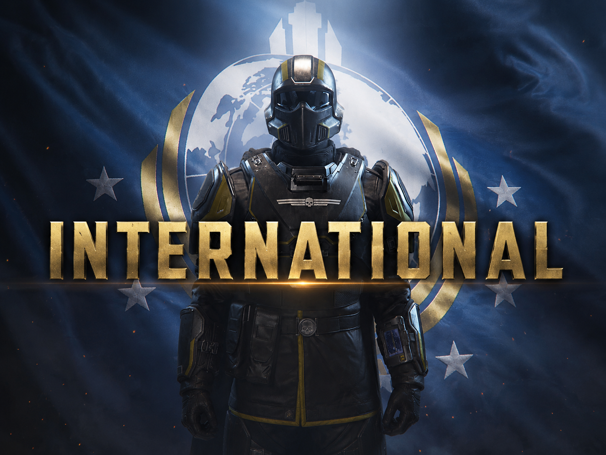

<h1 align="center">Helldivers International Randomizer</h1>

<em>Randomizza voce e lingua per ciascuno slot vocale degli Helldiver. Strumento complementare alla mod Helldivers International.</em>

 

| [English](README.md) | [Español · ES](README.es.md) | [Español LATAM · MS](README.ms.md) | [日本語 · JP](README.jp.md) | [Deutsch · DE](README.de.md) | [Français · FR](README.fr.md) | [Italiano · IT](README.it.md) | [Português · BP](README.bp.md) | [简体中文 · CN](README.cn.md) | [Русский · RU](README.ru.md) | [한국어 · KO](README.ko.md) |

---

## 🎮 Funzioni

> **Mod richiesto:** questa app complementare non funziona da sola. Scarica e installa prima [Helldivers International da Nexus Mods](https://www.nexusmods.com/helldivers2/mods/14183). Usa il file principale per le nove lingue del gioco e il file **Fandubs** della stessa pagina per le voci russa o coreana. Seleziona la cartella del mod installato; se non usi Arsenal, estrai prima l’archivio scaricato. Il Randomizer non include il mod né i suoi audio.

Assegna casualmente tipo di voce e lingua ai quattro slot vocali degli Helldiver e scrive file patch nella cartella dati di Helldivers 2. Supporta le nove lingue del gioco e, se incluse nella mod selezionata, le fandub russa e coreana.

## 🚀 Installazione e uso

1. Scarica **HelldiversInternational-Randomizer.exe** con il pulsante qui sopra.
2. Seleziona la cartella della mod che contiene **manifest.json**.
3. Seleziona la cartella **data** di Helldivers 2 che contiene **bundles.nxa**.
4. Scegli le opzioni e premi **Randomize**.

Se ridistribuisci o aggiorni la mod principale in Arsenal, esegui di nuovo il Randomizer.

## 🛡️ Codice sorgente e build

L’eseguibile viene compilato dal codice Python di questo repository con GitHub Actions. Il test di avvio su Windows è riuscito. Non contiene audio del gioco: all’avvio legge la mod installata e scrive i file patch.

GitHub Actions usa Python 3.12 e PyInstaller. Il parser audio è scaricato al commit fissato **c408a44**. Nessun file del gioco è incluso.

**SHA-256:** A3005AADDF57AE3EE7208DCDFDDBEBC4030D5C5C415C296132A03B1E6D094D62

[Codice sorgente](https://github.com/IHanfoxI/helldivers-international-randomizer-windows/blob/main/randomizer_gui.py) · [Workflow di build](https://github.com/IHanfoxI/helldivers-international-randomizer-windows/blob/main/.github/workflows/build-randomizer.yml) · [Build Windows riuscita](https://github.com/IHanfoxI/helldivers-international-randomizer-windows/actions/runs/36000112609)
